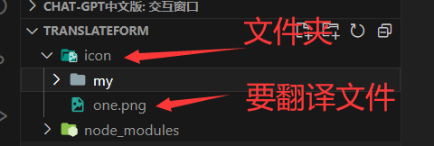

# 文件夹中英文翻译插件

**使用须知：使用前切记全局安装 axios**

```
npm i axios -g

or

yarn add axios -g
```

## 安装

```
npm i translateing

or

yarn add translateing
```

## 使用

```
npm link translateing
```

在命令行输入命令**translateing**

并加上您项目里要翻译的目标文件夹

```
// 命令后面添加文件夹路径时务必携带 --
translateing --./icon/my

```



## 您可以看到目标文件夹下面的文件名已经翻译成了您需要的类型

> 这里注意带空格/大写开头的会被转义成下划线

后面会继续改进，谢谢支持
